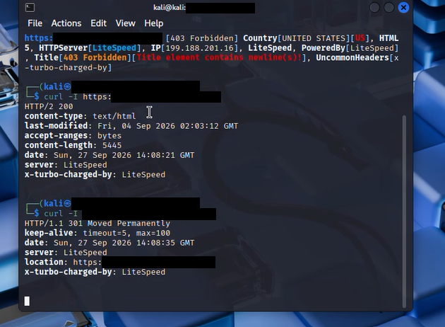
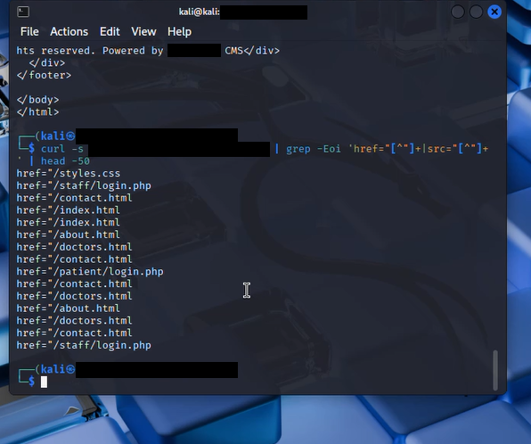
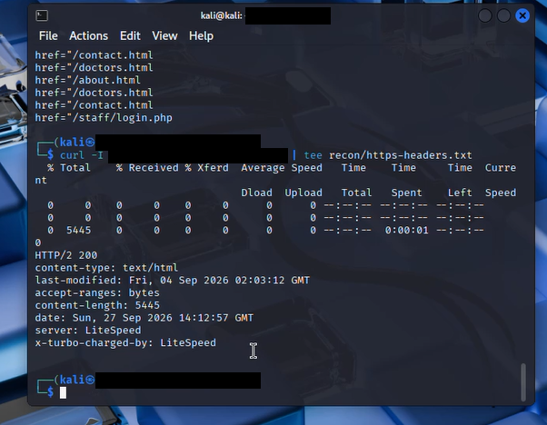
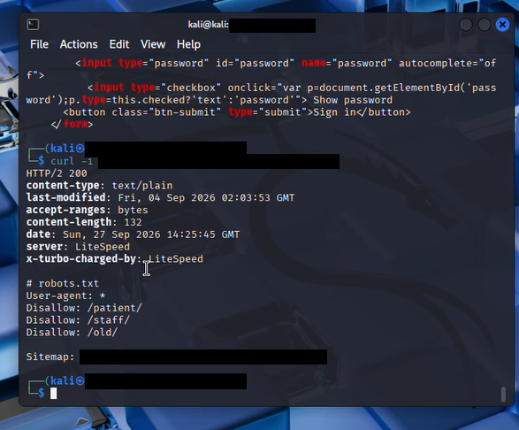
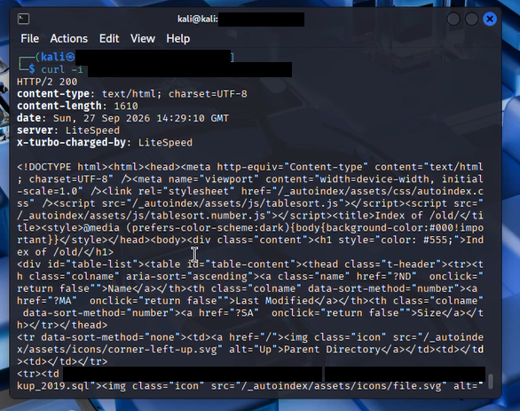
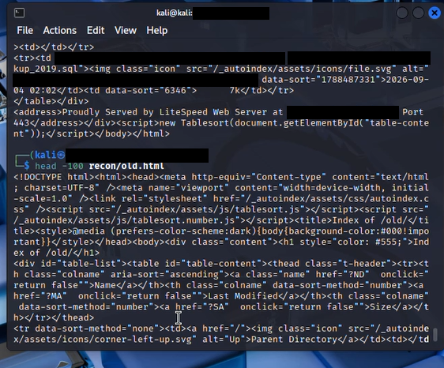
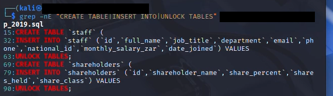

# Web Application Security Assessment — Hospital Web Application

A black-box web application security assessment performed as part of the **Cybersecurity Internship Program at Networkwalks Technologies**. The engagement covered unauthenticated reconnaissance, exposed resource discovery, and access-control validation against a hospital web application.

> ⚠️ **Disclaimer:** This assessment was carried out under an authorized training/internship engagement. Target identifying details (domain, organization name) have been redacted from all evidence below. This report is shared for educational and portfolio purposes only — do not use these techniques against systems you don't have explicit permission to test.

---

## 🎯 Objective

To identify security weaknesses in a publicly accessible hospital web application, including:
- Exposed backend resources and backup files
- Directory listing and information disclosure
- Authentication behavior and access-control enforcement

---

## 🧰 Environment & Tools

| Item | Detail |
|---|---|
| Testing OS | Kali Linux |
| Target Stack | PHP 8.2.33, LiteSpeed Web Server |
| CMS | *(redacted)* CMS 1.4.2 |
| Techniques | Manual reconnaissance, HTTP inspection, directory discovery, `robots.txt`/`sitemap.xml` review, controlled authentication testing |

---

## 🔍 Methodology

1. Website reconnaissance & HTTP header inspection
2. `robots.txt` and `sitemap.xml` analysis
3. Directory and resource discovery
4. Identification of exposed backup files
5. Analysis of exposed database backup contents
6. Patient/staff authentication flow testing
7. Access-control validation on protected resources
8. Evidence collection and reporting

---

## 📸 Evidence Walkthrough

### 1. HTTP Header & Response Inspection
Initial reconnaissance using `curl -I` to inspect server headers, redirect behavior, and technology fingerprinting (LiteSpeed, PHP 8.2.33).

### 2. Link & Resource Discovery
Extracting internal links (`href=` / `src=`) from the homepage to map out application structure — surfacing `/staff/login.php` and `/patient/login.php` early.

### 3. Capturing Headers for Reporting
Saving HTTPS response headers to a recon file for evidence and later reference.

### 4. `robots.txt` Disclosure
`robots.txt` disallowed `/patient/`, `/staff/`, and `/old/` — inadvertently pointing to sensitive paths not intended for public discovery.

### 5. Directory Listing on `/old/`
Directory indexing was enabled on `/old/`, exposing a downloadable SQL backup file directly to unauthenticated visitors.

### 6. Backup File Exposure
The directory listing confirmed the backup file's name, last-modified date, and size — all retrievable without authentication.

### 7 & 8. Database Schema Confirmation
Using `grep` against the retrieved backup to confirm table structures — revealing `staff` and `shareholders` tables containing PII (national ID, salary) and ownership data.

---

## 📊 Findings Summary

| ID | Finding | Severity | Status |
|----|---------|----------|--------|
| M2 | Publicly accessible database backup containing confidential staff & shareholder records | 🔴 Critical | Confirmed |
| M3 | Directory listing exposing patient application resources | 🟠 High | Confirmed |
| M5 | Login response reveals "Username not found" | 🟡 Medium | Observed |
| M1 | Sensitive directory disclosure via `robots.txt` | 🟢 Low | Confirmed |
| M4 | Technology / version disclosure | 🟢 Low | Confirmed |
| M6–M8 | Positive access controls (unauth. portal/reports/download all correctly blocked) | ✅ Positive | Confirmed |

---

## 🚨 Critical Finding Highlight

An internal SQL database backup was directly downloadable, without authentication, from a directory disclosed via `robots.txt`. The backup exposed:
- Staff records (names, roles, department, contact info, national ID, salary, join date)
- Shareholder records (name, ownership %, shares held, share class)

**Root cause:** Backup file stored inside the public web root with directory listing enabled and no server-side access restriction.

---

## ✅ Positive Controls Observed

- Unauthenticated access to the patient portal correctly redirected to login (`302`)
- Direct access to the patient reports directory was denied (`403 Forbidden`)
- Session cookie included the `Secure` attribute

---

## 🛠️ Key Recommendations

1. Remove the exposed backup immediately; store backups outside the web root
2. Disable directory listing on all sensitive paths (`/patient/`, `/staff/`, `/old/`)
3. Audit the web root for other backup/log file types (`.sql`, `.bak`, `.zip`, `error_log`, etc.)
4. Replace specific auth failure messages with a generic error
5. Reduce technology/version disclosure in headers and metadata
6. Assess regulatory/notification obligations given exposed PII

---

## 📁 Report Contents

- Executive summary & scope
- Full technical findings (M1–M8) with evidence
- Risk assessment (Critical → Low)
- Remediation plan with priority ordering
- Retesting checklist

---

## 👤 About

Assessment conducted by **Sheeza Alam Khan**, Cybersecurity Intern, Networkwalks Technologies.

Connect: [LinkedIn](#) · [GitHub](#)
